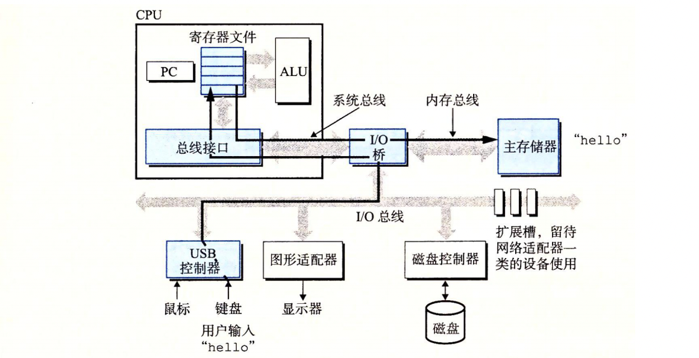

## 执行过程
#### 1 hello, world 的执行过程
##### 第一步：命令输入

- `shell` 在终端上等待用户输入命令
- 当我们在键盘上输入 `./hello`（注意：这是已经编译好的可执行文件名）时，字符会先进入内核的输入缓冲区
- `shell` 程序从缓冲区逐个读取字符，并在自己的内存空间中保存这条命令字符串

 
     

##### 第二步：程序加载

- 当我们按下回车键时，`shell` 知道命令输入结束
- `shell` 调用 `execve 系统调用`，请求内核加载并运行 `hello` 程序。
- 内核读取磁盘上的 `hello` 可执行文件，将其中的代码段（机器指令）、数据段和只读数据段（其中包含 `"hello, world\n"` 字符串）加载到进程的虚拟内存空间

 
     

##### 第三步：程序执行

- 一旦加载完成，`CPU` 的指令寄存器跳转到 `main` 函数的入口，开始执行机器指令。
- 在执行过程中，`printf` 函数会调用底层的 `write` 系统调用。
- 内核把 `"hello, world\n"` 这段字符串从用户态缓冲区复制到内核缓冲区，再通过设备驱动写入显示设备。
- 最终，我们在屏幕上看到输出结果

 
     

#### 2 程序在计算机内的存储与传递

通过这个过程，我们可以看到：程序的运行本质上是 信息在不同存储层次之间不断传递：

- hello 的机器指令最初存放在 **磁盘** 上
- 加载时，这些指令被复制（或映射）到 主存
- 当处理器运行程序时，指令又从主存被取入 **CPU 寄存器 **执行

同样，数据 `"hello, world\n"`：

- 最初位于可执行文件的 只读数据段（在磁盘上）
- 程序加载时被映射到 内存
- 执行时通过系统调用复制到 内核缓冲区
- 最终写入 显示设备，呈现在屏幕上

这说明了一个重要规律：计算机系统的工作就是不断地在 `磁盘—内存—寄存器—外设` 之间搬运和处理数据。